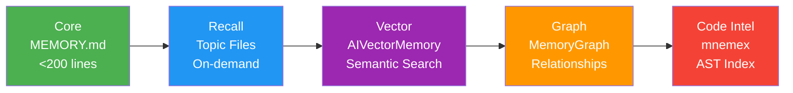

<div align="center">

# 🔋 Endurance Plan / 续航计划

### Claude Code Token Optimization Toolkit

**Reduce Claude Code token consumption through bidirectional compression,<br/>intelligent skill tiering, model routing, and multi-backend memory.**

[](LICENSE)
[](#platform-support)
[](#platform-support)
[](https://code.claude.com/)
[](https://github.com/qiuxinyuan321/endurance-plan/stargazers)

<br/>

[**Quick Start**](#-quick-start) · [**Components**](#-components) · [**Memory**](#-five-tier-memory) · [**Evidence**](#-evidence) · [**Architecture**](#-architecture) · [**Credits**](#-credits)

</div>

---

## ⚡ Problem

Claude Code consumes significant tokens per session. Major cost sinks:

| Source | Impact |
|--------|--------|
| CLI output (build/test/diff) floods context | Thousands of tokens per command |
| 150+ skill descriptions in system prompt | ~10K tokens/turn |
| Opus for all tasks, including simple searches | Top-tier model cost on trivial work |
| Maximum thinking budget on simple queries | Unnecessary thinking tokens |
| No cross-session knowledge persistence | Repeated context loading |

## 🛡️ Components

| Component | What It Does | Savings | Evidence |
|-----------|-------------|---------|----------|
| **RTK** | CLI output compression (smart filters per command) | **67-97%** ✓ | [Measured: 132 commands, 125.6K→4.3K tokens](benchmark/results/rtk.json) |
| **LLMLingua** | Input prompt compression via BERT (optional hook) | **2-5x** † | [Upstream claim, not independently measured](https://github.com/microsoft/LLMLingua) |
| **Skill Tiering** | 23 always-on + 158 on-demand via skill-loader | **~8K tokens/turn** ~ | Estimated: 181→23 skill descriptions |
| **Model Routing** | Sonnet/Haiku subagents for lightweight tasks | **~60% cost** ~ | Estimated from public model pricing |
| **Thinking Budget** | `effortLevel` control (high default) | **~50%** ~ | Estimated: high vs max effort |
| **Hooks** | Safety guard + test output filter | **varies** | [27 golden tests passing](benchmark/hook-tests/) |
| **.claudeignore** | Exclude build artifacts, lock files, models | — | Prevents context pollution |

> **Evidence key**: ✓ = measured locally · ~ = estimated from public data · † = upstream claim, not verified

---

## 🚀 Quick Start

<table>
<tr>
<td width="50%">

**Windows (PowerShell)**

```powershell
git clone https://github.com/qiuxinyuan321/endurance-plan.git
cd endurance-plan
.\install.ps1
```

</td>
<td width="50%">

**Linux / macOS / WSL**

```bash
git clone https://github.com/qiuxinyuan321/endurance-plan.git
cd endurance-plan
chmod +x install.sh && ./install.sh
```

</td>
</tr>
</table>

The installer automatically:
- Copies hooks and registers them in `settings.json`
- Registers MCP servers in `.claude.json`
- Deploys `.claudeignore`
- Runs skill tiering with backup

Restart Claude Code after installation.

---

## 🔧 Component Details

### RTK — CLI Output Compression

Binary tool that wraps CLI commands and compresses output before it enters the context window.

```bash
rtk npm test          # Compressed: only failures + summary
rtk err cargo build   # Show only errors
rtk summary git log   # AI-compressed summary
rtk gain              # Show compression statistics
```

> **Measured**: 132 commands, 96.6% overall compression (125.6K→4.3K tokens). Per-command range: 20-100% depending on output type. See [benchmark/results/rtk.json](benchmark/results/rtk.json).

### Skill Tiering

- **Tier 1** (23 skills): Core coding, memory, search, communication, tools — always loaded
- **Tier 2** (158 skills): Loaded on-demand by `skill-loader` when keywords match

<details>
<summary>Tiering Commands</summary>

```bash
python scripts/tier-skills.py              # Apply tiering (creates backup first)
python scripts/tier-skills.py --dry-run    # Preview changes
python scripts/rollback.py                 # Restore from backup
```

</details>

### Model Routing

| Agent | Model | Use Case |
|-------|-------|----------|
| `research` | Sonnet | Codebase exploration, file search, doc lookup |
| `quick-task` | Sonnet | Simple code changes, formatting |
| `test-runner` | Haiku | Run tests, report pass/fail |

### Hooks

Python-based, injection-safe hooks (all JSON output via `json.dumps`):

| Hook | Type | What It Does |
|------|------|-------------|
| `safety-guard.py` | PreToolUse | Blocks `rm -rf /`, fork bombs; warns on `--force` |
| `filter-test-output.py` | PreToolUse | Filters test output to failures + summary |
| `compress-input.py` | PostToolUse | LLMLingua-2 compression for large file reads (optional) |

All hooks have [golden tests](benchmark/hook-tests/) (27 test cases).

<details>
<summary>LLMLingua Input Compression (Optional)</summary>

```bash
pip install llmlingua  # ~500MB model download on first run
```

**Note**: Each hook invocation loads the 500MB model from scratch (~1-2s latency). This is a known limitation of the hook architecture. A daemon-based approach is planned for future versions.

</details>

---

## 🧬 Five-Tier Memory



| Tier | Backend | Best For | Dependency |
|------|---------|----------|------------|
| **Core** | MEMORY.md (always loaded) | Quick index, <200 lines | None |
| **Recall** | Topic markdown files | Structured notes, on-demand Read | None |
| **Vector** | [AIVectorMemory](https://github.com/Edlineas/aivectormemory) | Semantic search + issue tracking | Python + pip |
| **Graph** | [MemoryGraph](https://github.com/memory-graph/memory-graph) | Causal chains + multi-hop reasoning | Python + pip |
| **Code Intel** | [mnemex](https://github.com/mnemex/mnemex) | AST index + code references | bun + Ollama |

<details>
<summary>Memory Routing Guide</summary>

| Need | Tool |
|------|------|
| Store cross-session knowledge | AIVectorMemory `remember` |
| Semantic similarity search | AIVectorMemory `recall` |
| Track bugs/issues | AIVectorMemory `track` |
| Decompose tasks | AIVectorMemory `task` |
| Record causal relationships | MemoryGraph `store_memory` + `create_relationship` |
| Multi-hop reasoning | MemoryGraph `get_related_memories` |
| Code definitions/references | mnemex `define` / `references` / `search` |

**Fallback**: If MCP servers are unavailable, memory operations degrade to Recall tier (file-based). Operations never fail silently.

</details>

---

## 📊 Evidence

All claims are tracked in [benchmark/CLAIMS.md](benchmark/CLAIMS.md) with evidence status.

| Metric | Value | Method | Notes |
|--------|-------|--------|-------|
| RTK compression (overall) | 96.6% ✓ | Measured | 132 commands, single user workload |
| RTK compression (per-command median) | ~70% ✓ | Measured | Excluding 1 outlier (111K `find` output) |
| LLMLingua compression | 2-5x † | Upstream claim | Not independently measured |
| Skill tiering savings | ~8K tokens/turn ~ | Estimated | 181→23 skill descriptions |
| Model routing savings | ~60% cost ~ | Estimated | Opus→Sonnet/Haiku pricing delta |
| Thinking budget savings | ~50% ~ | Estimated | effortLevel high vs max |
| Hook test coverage | 27/27 ✓ | Measured | [Golden test suite](benchmark/hook-tests/) |

### Platform Support

| Platform | Support Level | RTK | Hooks | MCP | Skills |
|----------|--------------|-----|-------|-----|--------|
| **Windows 10/11** | Full | ✓ | ✓ | ✓ | ✓ |
| **Linux** | Partial — no RTK | ✗ | ✓ | ✓ | ✓ |
| **macOS** | Partial — no RTK | ✗ | ✓ | ✓ | ✓ |
| **WSL** | Full via Windows host | ✓ | ✓ | ✓ | ✓ |

RTK is a Windows-only binary. On other platforms, all components except RTK work normally.

---

## 🏗️ Architecture

```
~/.claude/
├── CLAUDE.md                    # RTK + model routing + thinking budget + memory governance
├── settings.json                # effortLevel, hooks registration
├── hooks/
│   ├── safety-guard.py          # Block/warn dangerous commands
│   ├── filter-test-output.py    # Filter test output
│   └── compress-input.py        # LLMLingua compression (optional)
├── agents/
│   ├── research.md              # Sonnet - codebase exploration
│   ├── quick-task.md            # Sonnet - simple changes
│   └── test-runner.md           # Haiku - test execution
└── skills/
    └── skill-loader/            # On-demand skill routing

~/.claude.json                   # MCP server registrations (auto-configured)
~/.claudeignore                  # Build artifact exclusion (auto-deployed)

MCP Servers:
├── aivectormemory               # Vector memory + issue/task
├── memorygraph                  # Graph memory + relationships
└── mnemex                       # Code intelligence (optional, needs Ollama)
```

<details>
<summary>Rollback</summary>

```bash
python scripts/rollback.py       # Restore skill manifests from backup
rm ~/.local/bin/rtk.exe          # Remove RTK
pip uninstall aivectormemory memorygraphMCP  # Remove memory backends
# Hooks and MCP configs can be manually removed from settings.json / .claude.json
```

</details>

---

## 🙏 Credits

- [AIVectorMemory](https://github.com/Edlineas/aivectormemory) — Vector memory + issue tracking
- [MemoryGraph](https://github.com/memory-graph/memory-graph) — Graph-based relationship memory
- [LLMLingua](https://github.com/microsoft/LLMLingua) — Token-level prompt compression
- [OpenHands](https://github.com/All-Hands-AI/OpenHands) — Safety hook architecture inspiration

## Requirements

- [Claude Code](https://code.claude.com/) CLI
- Python 3.10+
- Windows 10/11 (full support) or Mac/Linux (partial — no RTK)

## License

MIT

---

<div align="center">

[](https://star-history.com/#qiuxinyuan321/endurance-plan&Date)

</div>
