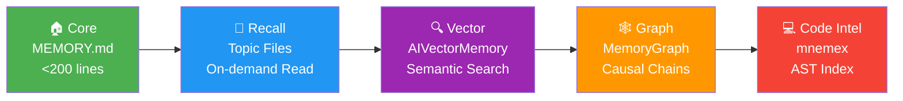

<div align="center">

# 🔋 Endurance Plan / 续航计划

### Claude Code Token Optimization + Intelligent Memory Toolkit

**目前唯一的全栈 Claude Code 优化方案 — 覆盖 7 个优化维度 + 5 层智能记忆**

[](LICENSE)
[](#-quick-start)
[](https://code.claude.com/)
[](https://github.com/qiuxinyuan321/endurance-plan/stargazers)

<br/>

[**快速开始**](#-quick-start) · [**核心组件**](#-token-optimization) · [**五层记忆**](#-five-tier-memory) · [**架构**](#-architecture) · [**对比**](#-comparison) · [**鸣谢**](#-credits)

<br/>

> 💡 **Claude Code 每天消耗 ~$6-12/开发者。续航计划通过双向压缩 + 智能分层 + 模型路由 + 多后端记忆，将消耗降低 60-90%。**

</div>

---

## ⚡ Problem

| 痛点 | 浪费 |
|------|------|
| CLI 输出（build/test）灌满上下文窗口 | 数万 tokens/次 |
| 150+ 技能描述注入每轮 system prompt | ~10K tokens/轮 |
| 所有任务都用 Opus | 简单搜索也烧顶级模型 |
| 最大思考预算跑简单查询 | 数千 tokens 思考输出 |
| 无跨会话记忆策略 | 重复上下文加载 |

---

## 🛡️ Solution Overview

```
┌─────────────────────────────────────────────────────────────┐
│                    Endurance Plan                           │
│                                                             │
│   Input ──LLMLingua 2-5x──→ Context ──RTK 97%──→ Output    │
│                                                             │
│   ┌───────────┐  ┌───────────┐  ┌──────────────┐          │
│   │  Skill    │  │  Model    │  │  Thinking    │          │
│   │  Tiering  │  │  Routing  │  │  Budget      │          │
│   │  -8K/turn │  │  -60%cost │  │  -50%tokens  │          │
│   └───────────┘  └───────────┘  └──────────────┘          │
│                                                             │
│   ┌─────────────────────────────────────────────┐          │
│   │  Five-Tier Memory (Core→Recall→Vector→      │          │
│   │                     Graph→Code Intel)        │          │
│   └─────────────────────────────────────────────┘          │
└─────────────────────────────────────────────────────────────┘
```

### Token Optimization Components

| Component | What It Does | Savings |
|-----------|-------------|---------|
| 🗜️ **RTK** | CLI output compression (smart filters per command) | **60-90%** per command |
| 📐 **LLMLingua** | Input prompt compression via BERT (PostToolUse hook) | **2-5x** on large files |
| 📦 **Skill Tiering** | 23 always-on + 158 on-demand via skill-loader | **~8K** tokens/turn |
| 🤖 **Model Routing** | Sonnet/Haiku subagents for lightweight tasks | **~60%** cost on delegated tasks |
| 🧠 **Thinking Budget** | `effortLevel: high` default, max on demand | **~50%** thinking tokens |
| 🪝 **Hooks** | Test output filter + safety guard | **90%+** on test output |
| 🚫 **.claudeignore** | Exclude build artifacts, lock files, models | Prevents context pollution |

---

## 🚀 Quick Start

<table>
<tr>
<td width="50%">

**Windows (PowerShell)**

```powershell
git clone https://github.com/qiuxinyuan321/endurance-plan.git
cd endurance-plan
.\install.ps1
```

</td>
<td width="50%">

**Linux / macOS / WSL**

```bash
git clone https://github.com/qiuxinyuan321/endurance-plan.git
cd endurance-plan
chmod +x install.sh && ./install.sh
```

</td>
</tr>
</table>

> 安装完成后重启 Claude Code 即可生效。

---

## 🔧 Core Components

### 🗜️ RTK — CLI Output Compression

A binary tool that wraps CLI commands and compresses their output before it enters the context window.

```bash
rtk npm test          # Compressed: only failures + summary
rtk err cargo build   # Show only errors
rtk summary git log   # AI-compressed summary
rtk gain              # Show compression statistics
```

> **Average compression: 97%** on tested workloads (121K → ~3.6K tokens)

### 📦 Skill Tiering

Split skills into always-on (Tier 1) and on-demand (Tier 2):

- **Tier 1** (23 skills): Core coding, memory, search, communication, tools
- **Tier 2** (158 skills): Loaded by `skill-loader` when triggered by keywords

<details>
<summary>📋 Tiering Commands</summary>

```bash
python scripts/tier-skills.py              # Apply tiering
python scripts/tier-skills.py --dry-run    # Preview changes
python scripts/rollback.py                 # Restore from backup
```

</details>

### 🤖 Model Routing

Three subagent definitions optimized for cost:

| Agent | Model | Use Case |
|-------|-------|----------|
| `research` | Sonnet | Codebase exploration, file search, doc lookup |
| `quick-task` | Sonnet | Simple code changes, formatting |
| `test-runner` | Haiku | Run tests, report pass/fail |

### 🧠 Thinking Budget Control

Default `effortLevel: high` balances quality and cost:

| Level | When to Use |
|-------|-------------|
| `max` | Complex architecture, multi-step debugging |
| `high` | Daily coding (default) |
| `low` | Simple queries, status checks |

### 🪝 Hooks System

Three production-ready hooks for token optimization and safety:

| Hook | Type | What It Does |
|------|------|-------------|
| **safety-guard.sh** | PreToolUse | Blocks `rm -rf /`, fork bombs, warns on `--force` |
| **filter-test-output.sh** | PreToolUse | Filters test output to failures + summary only |
| **compress-input.py** | PostToolUse | LLMLingua-2 compression for large file reads (optional) |

<details>
<summary>📋 Hook Installation</summary>

```bash
mkdir -p ~/.claude/hooks
cp hooks/*.sh hooks/*.py ~/.claude/hooks/
# Then merge templates/hooks.json.template into ~/.claude/settings.json
```

</details>

---

## 🧬 Five-Tier Memory



| Tier | Backend | Best For |
|------|---------|----------|
| **Core** | MEMORY.md (always loaded) | Quick index, <200 lines |
| **Recall** | Topic markdown files | Structured notes, on-demand Read |
| **Vector** | [AIVectorMemory](https://github.com/Edlineas/aivectormemory) | Semantic search + issue tracking + task management |
| **Graph** | [MemoryGraph](https://github.com/memory-graph/memory-graph) | Causal chains + relationships + multi-hop reasoning |
| **Code Intel** | [mnemex](https://github.com/mnemex/mnemex) | AST index + code definitions + references |

<details>
<summary>🗺️ Memory Routing Guide</summary>

| Need | Tool |
|------|------|
| Store cross-session knowledge | AIVectorMemory `remember` |
| Semantic similarity search | AIVectorMemory `recall` |
| Track bugs/issues | AIVectorMemory `track` |
| Decompose tasks | AIVectorMemory `task` |
| Record causal relationships | MemoryGraph `store_memory` + `create_relationship` |
| Multi-hop reasoning | MemoryGraph `recall_memories` + `get_related_memories` |
| Code definitions/references | mnemex `define` / `references` / `search` |

</details>

<details>
<summary>📐 LLMLingua Input Compression (Optional)</summary>

Bidirectional compression pipeline:

```
File read ──LLMLingua 2-5x──→ Claude context ──RTK 97%──→ CLI output
```

- Uses `microsoft/llmlingua-2-bert-base-multilingual-cased-meetingbank` (~500MB, no GPU)
- Compresses code and docs while preserving structure
- Configurable threshold and compression rate

```bash
pip install llmlingua  # ~500MB model downloads on first run
```

</details>

---

## 🏗️ Architecture

```
~/.claude/
├── CLAUDE.md                    # RTK + model routing + thinking budget + memory governance
├── settings.json                # effortLevel, model config, hooks
├── hooks/
│   ├── safety-guard.sh          # 🛡️ Block dangerous commands
│   ├── filter-test-output.sh    # 🧹 Filter test output
│   └── compress-input.py        # 📐 LLMLingua compression (optional)
├── agents/
│   ├── research.md              # 🔍 Sonnet - codebase exploration
│   ├── quick-task.md            # ⚡ Sonnet - simple changes
│   └── test-runner.md           # 🧪 Haiku - test execution
├── skills/
│   └── skill-loader/
│       ├── SKILL.md             # 📦 On-demand skill index + routing
│       └── manifest.json        # enabled: true, priority: 100
└── skills-archive/
    └── pre-tiering-YYYYMMDD/    # 📋 Backup of original manifests

MCP Servers (configured in ~/.claude.json):
├── aivectormemory               # 🔍 Vector memory + issue/task
├── memorygraph                  # 🕸️ Graph memory + relationships
├── mnemex                       # 💻 Code intelligence
└── github                       # 🐙 GitHub API
```

---

## 📊 Token Savings Summary

| Metric | Before | After | Reduction |
|--------|--------|-------|-----------|
| CLI output tokens | 100% raw | 3-10% | **🟢 90-97%** |
| Input file tokens | 100% raw | 20-50% | **🟢 50-80%** |
| Test output tokens | 100% raw | ~10% | **🟢 ~90%** |
| System prompt skills | ~10K/turn | ~2K/turn | **🟢 ~80%** |
| Model cost (delegated) | 100% (Opus) | ~40% (Sonnet/Haiku) | **🟢 ~60%** |
| Thinking tokens | Maximum | ~50% (high) | **🟢 ~50%** |
| Memory context | Variable | <200 lines | **🟢 Fixed** |
| Cross-session knowledge | Lost | Persistent | **🟢 ∞** |

---

## 🏆 Comparison

| Capability | 续航计划 | Context Engineering Kit | CCUsage/CCFlare | AIVectorMemory |
|-----------|---------|----------------------|----------------|----------------|
| CLI output compression | ✅ 97% (RTK) | ❌ | ❌ | ❌ |
| Input compression | ✅ 2-5x (LLMLingua) | ❌ | ❌ | ❌ |
| Skill tiering | ✅ ~8K saved/turn | ❌ | ❌ | ❌ |
| Model routing | ✅ Sonnet/Haiku | ✅ Sub-agents | ❌ | ❌ |
| Thinking budget | ✅ 3-level control | ❌ | ❌ | ❌ |
| Safety hooks | ✅ Block + Warn | ❌ | ❌ | ❌ |
| Vector memory | ✅ (integrated) | ❌ | ❌ | ✅ Native |
| Graph memory | ✅ (integrated) | ❌ | ❌ | ❌ |
| Code intelligence | ✅ (mnemex) | ❌ | ❌ | ❌ |
| Quality engineering | ❌ | ✅ 11 plugins | ❌ | ❌ |
| Usage dashboard | ❌ | ❌ | ✅ Native | ❌ |
| **Coverage** | **9/11** | **2/11** | **1/11** | **1/11** |

---

<details>
<summary>🔄 Rollback</summary>

Every operation is reversible:

```bash
python scripts/rollback.py                                    # Restore skill manifests
python scripts/rollback.py ~/.claude/skills-archive/pre-tiering-20260406/  # Specific backup
rm ~/.local/bin/rtk                                           # Remove RTK
pip uninstall aivectormemory memorygraphMCP                   # Remove memory backends
```

</details>

## 🙏 Credits

This toolkit integrates and builds upon:

- [**AIVectorMemory**](https://github.com/Edlineas/aivectormemory) by Edlineas — Vector memory + issue tracking
- [**MemoryGraph**](https://github.com/memory-graph/memory-graph) by memory-graph — Graph-based relationship memory
- [**LLMLingua**](https://github.com/microsoft/LLMLingua) by Microsoft Research — Token-level prompt compression
- [**awesome-claude-code**](https://github.com/hesreallyhim/awesome-claude-code) — Community hooks and patterns
- [**OpenHands**](https://github.com/All-Hands-AI/OpenHands) — Safety hook architecture inspiration

## 📋 Requirements

- [Claude Code](https://code.claude.com/) CLI installed
- Python 3.10+ (for memory backends and tiering scripts)
- Windows 10/11, macOS, or Linux

---

<div align="center">

## ⭐ Star History

[](https://star-history.com/#qiuxinyuan321/endurance-plan&Date)

**If this toolkit saves you tokens, give it a ⭐!**

MIT License · [Report Issue](https://github.com/qiuxinyuan321/endurance-plan/issues)

</div>
